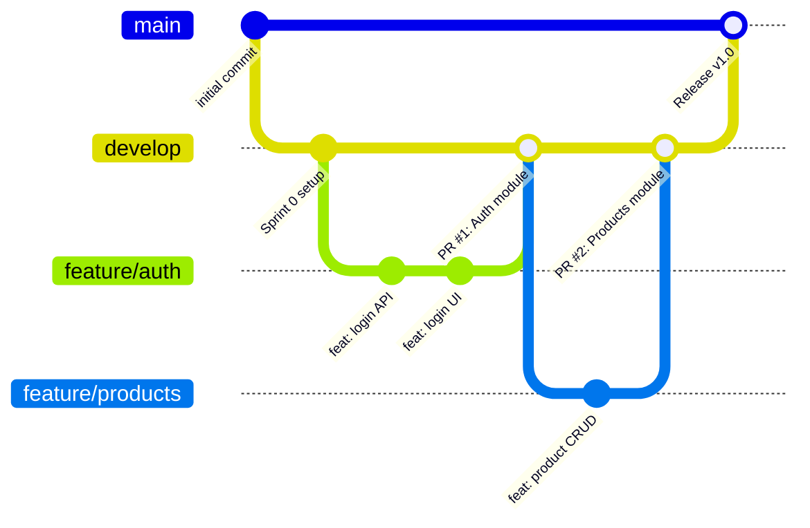

# Kế Hoạch Triển Khai Dự Án Hệ Thống POS

## Phần 1: Tổng Quan Dự Án (Từ MemPalace)

### 1.1 Bối Cảnh Dự Án
Đây là dự án **Thực tập cơ sở** của **Nhóm 6** (3 thành viên). Dự án đã hoàn thành **giai đoạn thiết kế** (8 tuần, từ phân tích yêu cầu → thiết kế cấp cao → thiết kế cấp thấp). Bây giờ chuyển sang **giai đoạn triển khai code**.

### 1.2 Tài Liệu Thiết Kế Đã Hoàn Thành
Dựa trên các tài liệu đã được nạp vào MemPalace:

| Giai đoạn | Tài liệu | Trạng thái |
|-----------|-----------|------------|
| Tuần 1-2 | Vision, Stakeholders, System Context, Use Cases, Process Modeling, Conceptual ERD | ✅ Hoàn thành |
| Tuần 3 | Yêu cầu chức năng, Yêu cầu phi chức năng, Wireframes UI, Navigation Flow | ✅ Hoàn thành |
| Tuần 5 | Component Diagram, API Specification, Physical ERD & Database Design | ✅ Hoàn thành |
| Tuần 6 | Class Diagrams (5 sơ đồ), Sequence Diagrams, High-Fidelity UI Mockups | ✅ Hoàn thành |

### 1.3 Các Chức Năng Chính Của Hệ Thống POS
Dựa trên wireframes, use cases và API spec đã thiết kế:
- **Quản lý bán hàng (POS Screen)**: Tạo đơn hàng, chọn sản phẩm, quản lý giỏ hàng
- **Thanh toán (Payment)**: Xử lý thanh toán (tiền mặt, thẻ), in hóa đơn
- **Quản lý sản phẩm**: CRUD sản phẩm, danh mục, giá
- **Quản lý khách hàng**: Thông tin khách hàng, lịch sử mua hàng
- **Quản lý đơn hàng**: Xem, cập nhật, hủy đơn hàng
- **Báo cáo (Reports)**: Doanh thu, thống kê bán hàng
- **Xác thực & Phân quyền**: Đăng nhập, phân vai trò (Admin, Cashier)

### 1.4 Thư Mục Làm Việc
- **Code dự án**: `D:\thuc_tap_co_so\he_thong_pos`
- **Tài liệu hướng dẫn**: `D:\thuc_tap_co_so\huong_dan_thuc_hien`
- **Tài liệu thiết kế**: Các thư mục `Nhom6 tuan 1`, `Nhom 6 tuan 2`, `Nhom_6_tuan_3`, `Nhom 6 phan 5`, `Nhom 6 phan 6`

---

## Phần 2: Lựa Chọn Công Nghệ (Technology Stack)

> [!IMPORTANT]
> Chuyển từ Web App sang **Desktop App** theo yêu cầu. Stack mới: **.NET 8 / C# / WPF / EF Core / SQL Server Docker**.

### 2.1 Tổng Quan Stack

| Layer | Công nghệ | Phiên bản | Lý do chọn |
|-------|-----------|-----------|------------|
| **Platform** | .NET 8 (LTS) | 8.0 | Long-Term Support, cross-platform, hiệu năng cao, ecosystem Microsoft |
| **Ngôn ngữ** | C# | 12 | Strongly-typed, OOP chuẩn, phù hợp học thuật, hỗ trợ async/await |
| **UI Framework** | WPF (Windows Presentation Foundation) | .NET 8 | Desktop-native, XAML binding, MVVM pattern, giao diện phong phú |
| **Architecture** | MVVM (Model-View-ViewModel) | — | Tách biệt UI/Logic, dễ test, dễ maintain, chuẩn WPF |
| **MVVM Toolkit** | CommunityToolkit.Mvvm | 8.x | [ObservableProperty], [RelayCommand], giảm boilerplate code |
| **ORM (Code-First)** | Entity Framework Core | 8.x | Code-first migration (viết Model C# → sinh SQL), LINQ query, type-safe |
| **Database** | SQL Server in Docker | SQL Server 2022 | Tương thích EF Core tốt nhất, chạy trong Docker container |
| **Authentication** | Custom (hash + session) | — | Ứng dụng Desktop không cần JWT, dùng BCrypt hash + in-memory session |
| **DI Container** | Microsoft.Extensions.DI | Built-in | Dependency Injection chuẩn .NET, quản lý lifetime Services |
| **Navigation** | Custom NavigationService | — | Điều hướng giữa các View trong WPF |
| **Charts** | LiveCharts2 | 2.x | Biểu đồ đẹp, tương thích WPF, animation mượt |
| **Printing** | WPF PrintDialog + FlowDocument | Built-in | In hóa đơn trực tiếp từ Desktop, không cần thư viện ngoài |
| **Testing** | xUnit + Moq | — | Framework test phổ biến nhất cho .NET |
| **Containerization** | Docker + Docker Compose | — | Chạy SQL Server container |

### 2.2 Giải Thích Chi Tiết Từng Lựa Chọn

#### Tại sao Desktop (WPF) thay vì Web?
- **POS chạy tại quầy**: Ứng dụng chạy trên máy tính cố định tại cửa hàng, không cần trình duyệt.
- **Hiệu năng**: Desktop app truy cập trực tiếp DB, không qua HTTP → nhanh hơn Web.
- **Tích hợp phần cứng**: Kết nối trực tiếp máy quét barcode (USB), máy in hóa đơn — dễ hơn Web.
- **Offline-first**: Hoạt động bình thường khi mất mạng (FR-02, NFR-R-001).

#### Architecture: MVVM Pattern
```
┌─────────────┐     Data Binding      ┌──────────────┐     Methods      ┌─────────────┐
│    VIEW      │ ◄──────────────────► │  VIEWMODEL   │ ◄─────────────► │    MODEL     │
│  (XAML/UI)   │   Commands/Events    │  (C# Logic)  │   EF Core       │  (DB Entity) │
└─────────────┘                       └──────────────┘                  └─────────────┘
  LoginView.xaml                        LoginViewModel.cs               NhanVien.cs
  POSView.xaml                          POSViewModel.cs                 DonHang.cs
```
- **View** (XAML): Chỉ chứa giao diện, không chứa logic.
- **ViewModel** (C#): Xử lý logic, gọi Service, expose data cho View qua Binding.
- **Model** (C# Entity): Đại diện bảng DB, được EF Core map tự động.

#### ORM Code-First: Entity Framework Core
- Viết class C# (Model) → chạy `dotnet ef migrations add` → EF Core tự sinh SQL migration.
- Dùng **Fluent API** để cấu hình quan hệ, constraints (giống Physical ERD đã thiết kế).
- **LINQ** thay SQL: `context.DonHangs.Where(d => d.TrangThai == "COMPLETED").Sum(d => d.TongThanhToan)`.

#### Database: SQL Server trong Docker
- `docker compose up` → SQL Server container sẵn sàng, không cần cài SQL Server lên máy.
- Connection string qua biến môi trường (.env), không hardcode password.
- Phù hợp với Physical ERD đã thiết kế (DOC 5.3-A).

### 2.3 Cấu Trúc Thư Mục Dự Án (.NET Solution)

```
he_thong_pos/
├── docker-compose.yml                  # SQL Server 2022 container
├── .gitignore
├── README.md
├── HeThongPOS.sln                      # Solution file
│
├── src/
│   ├── HeThongPOS.Core/               # ← Layer 1: Domain Models + Interfaces
│   │   ├── Entities/                   # EF Core Entity classes (từ Physical ERD)
│   │   │   ├── NhanVien.cs
│   │   │   ├── VaiTro.cs
│   │   │   ├── CaLamViec.cs
│   │   │   ├── SanPham.cs
│   │   │   ├── DanhMuc.cs
│   │   │   ├── DonHang.cs
│   │   │   ├── ChiTietDonHang.cs
│   │   │   ├── GiaoDich.cs
│   │   │   ├── PhuongThucThanhToan.cs
│   │   │   └── KhachHang.cs
│   │   ├── Interfaces/                 # Repository + Service interfaces
│   │   │   ├── IAuthService.cs
│   │   │   ├── IProductRepository.cs
│   │   │   ├── IOrderService.cs
│   │   │   └── ...
│   │   └── Enums/
│   │       ├── OrderStatus.cs          # PENDING, COMPLETED, CANCELLED
│   │       └── PaymentMethod.cs        # CASH, CARD
│   │
│   ├── HeThongPOS.Infrastructure/      # ← Layer 2: Data Access + EF Core
│   │   ├── Data/
│   │   │   ├── AppDbContext.cs          # DbContext chính
│   │   │   └── Configurations/         # Fluent API configs
│   │   │       ├── NhanVienConfig.cs
│   │   │       ├── DonHangConfig.cs
│   │   │       └── ...
│   │   ├── Migrations/                 # ← Auto-generated bởi EF Core
│   │   ├── Repositories/              # Repository implementations
│   │   │   ├── ProductRepository.cs
│   │   │   ├── OrderRepository.cs
│   │   │   └── ...
│   │   └── Seeders/
│   │       └── DataSeeder.cs           # Dữ liệu mẫu (50 SP, 20 KH...)
│   │
│   ├── HeThongPOS.Application/         # ← Layer 3: Business Logic (Services)
│   │   ├── Services/
│   │   │   ├── AuthService.cs
│   │   │   ├── ProductService.cs
│   │   │   ├── OrderService.cs
│   │   │   ├── PaymentService.cs
│   │   │   ├── ShiftService.cs
│   │   │   └── ReportService.cs
│   │   └── DTOs/                       # Data Transfer Objects
│   │       ├── LoginRequest.cs
│   │       ├── OrderCreateDto.cs
│   │       └── ...
│   │
│   └── HeThongPOS.WPF/                # ← Layer 4: UI (WPF Desktop App)
│       ├── App.xaml / App.xaml.cs       # Entry point, DI setup
│       ├── Views/                      # XAML UI (các màn hình)
│       │   ├── LoginView.xaml           # S-LOGIN-001
│       │   ├── ShiftView.xaml           # S-OPEN-002, S-CLOSE-003
│       │   ├── POSView.xaml             # S-MPS-001 (màn hình bán hàng)
│       │   ├── PaymentView.xaml         # S-PAY-001
│       │   ├── BillPreviewView.xaml     # S-RECEIPT-001
│       │   ├── OrdersView.xaml          # Danh sách đơn hàng
│       │   ├── ProductsView.xaml        # Quản lý sản phẩm (Admin)
│       │   ├── CustomersView.xaml       # Quản lý khách hàng (Admin)
│       │   ├── ReportsView.xaml         # S-RPT-001
│       │   └── SettingsView.xaml        # Cài đặt
│       ├── ViewModels/                 # ViewModel classes (logic)
│       │   ├── LoginViewModel.cs
│       │   ├── ShiftViewModel.cs
│       │   ├── POSViewModel.cs
│       │   ├── PaymentViewModel.cs
│       │   ├── OrdersViewModel.cs
│       │   ├── ProductsViewModel.cs
│       │   ├── ReportsViewModel.cs
│       │   └── MainViewModel.cs
│       ├── Controls/                   # Custom UserControls
│       │   ├── CartControl.xaml         # Cart sidebar
│       │   ├── ProductCard.xaml         # SP card trong grid
│       │   └── BarcodeInput.xaml        # Input quét mã
│       ├── Converters/                 # Value converters cho XAML
│       │   ├── CurrencyConverter.cs     # Decimal → "50,000 ₫"
│       │   └── BoolToVisibility.cs
│       ├── Services/
│       │   └── NavigationService.cs     # Điều hướng View
│       └── Resources/
│           ├── Styles.xaml              # Theme, Colors, Fonts
│           └── Icons/                   # SVG/PNG icons
│
├── tests/
│   ├── HeThongPOS.UnitTests/           # xUnit + Moq
│   └── HeThongPOS.IntegrationTests/    # Test với DB thực
│
└── docs/
    └── user-guide.md
```

### 2.4 So Sánh Web vs Desktop

| Tiêu chí | Web (React + Node.js) | Desktop (WPF + .NET 8) ✅ |
|-----------|----------------------|---------------------------|
| Ngôn ngữ | JavaScript/TypeScript | **C#** (strongly-typed, OOP) |
| Kiến trúc | SPA + REST API | **MVVM** (trực tiếp gọi Service) |
| Truy cập DB | Qua HTTP API | **Trực tiếp qua EF Core** (nhanh hơn) |
| Phần cứng | Khó (Web USB API) | **Dễ** (USB barcode, máy in trực tiếp) |
| Offline | Cần ServiceWorker | **Mặc định offline** (local DB) |
| Học thuật | Nhiều công nghệ | **1 ngôn ngữ C#** cho toàn bộ |

### 2.5 Rủi Ro Công Nghệ

| Rủi ro | Khả năng | Giảm thiểu |
|--------|----------|------------|
| Chưa quen WPF XAML Binding | Cao | Sprint 0 làm tutorial MVVM cơ bản |
| EF Core migration xung đột khi merge | Trung bình | Chỉ 1 người sửa Entity/DbContext mỗi sprint |
| Docker không chạy trên máy yếu | Thấp | Dùng SQL Server Express cài trực tiếp |
| WPF chỉ chạy trên Windows | Thấp | POS chạy trên máy cửa hàng (luôn là Windows) |

> [!NOTE]
> **Xác nhận trước khi tiếp tục:**
> 1. Nhóm đã cài **.NET 8 SDK** chưa? (`dotnet --version` để kiểm tra)
> 2. IDE: **Visual Studio 2022** (Community, miễn phí) hay **Rider**?
> 3. Docker đã cài chưa trên máy?

---

## Phần 3: Task List Chi Tiết Theo Sprint (3 Dev)

> [!IMPORTANT]
> Mỗi Sprint kéo dài **1 tuần**. Sprint 0 là setup chung, từ Sprint 1 trở đi mỗi Dev sẽ làm độc lập trên module riêng.

### Quy Tắc Git Workflow



**Quy tắc:**
- Nhánh chính: `main` (production-ready code)
- Nhánh phát triển: `develop` (integration branch)
- Mỗi task/feature: tạo nhánh `feature/<tên-feature>` từ `develop`
- Khi xong feature → tạo Pull Request vào `develop`
- Cuối sprint → merge `develop` vào `main`

---

### Phạm Vi: Ánh Xạ 26 FR → Màn Hình → DB → Sprint

| Nhóm chức năng | UC | FR IDs | Màn hình (Screen ID) | Bảng DB chính | Sprint |
|---|---|---|---|---|---|
| Đăng nhập & Quản lý ca | UC-01, UC-02 | FR-01→06 | S-LOGIN-001, S-OPEN-002, S-CLOSE-003 | `NHAN_VIEN`, `VAI_TRO`, `CA_LAM_VIEC` | 1, 2 |
| Bán hàng & Quét mã | UC-03, UC-04 | FR-07→12 | S-MPS-001 (POS chính) | `SAN_PHAM`, `CHI_TIET_DON_HANG` | 2 |
| Tính toán & Giá trị | UC-05 | FR-13→16 | S-MPS-001 (Cart/Summary) | `DON_HANG`, `CHI_TIET_DON_HANG` | 2 |
| Thanh toán | UC-06 | FR-17→20 | S-PAY-001 | `PHUONG_THUC_THANH_TOAN`, `GIAO_DICH` | 3 |
| Hóa đơn & Báo cáo | UC-07, UC-08 | FR-21→26 | S-RECEIPT-001, S-RPT-001 | `HOA_DON`, `DON_HANG` (aggregate) | 3, 4 |

> **Tổng: 26 FR (17 Phải có / 9 Nên có) · 8 UC · 8 Màn hình · 10 Bảng DB**

---

### Sprint 0: Project Setup (Cả 3 Dev cùng làm — 2-3 ngày)

| # | Task | Dev | File chính | Công nghệ | Mô tả |
|---|------|-----|-----------|-----------|-------|
| 0.1 | Tạo Git repository | A | `.gitignore`, `README.md` | Git, GitHub | Tạo repo, nhánh `main` + `develop` |
| 0.2 | Tạo Docker config | A | `docker-compose.yml`, `.env` | Docker, SQL Server 2022 | Container SQL Server + volume persist |
| 0.3 | Tạo .NET Solution | B | `HeThongPOS.sln` | .NET 8, dotnet CLI | `dotnet new sln`, tạo 4 projects (Core, Infrastructure, Application, WPF) |
| 0.4 | Viết EF Core Entities | B | `Core/Entities/*.cs` | C#, EF Core | Dịch Physical ERD → 10 Entity classes |
| 0.5 | Viết DbContext + Fluent API | B | `Infrastructure/Data/AppDbContext.cs`, `Configurations/*.cs` | EF Core | Cấu hình quan hệ, constraints, chạy `dotnet ef migrations add` |
| 0.6 | Tạo WPF Shell | C | `WPF/App.xaml`, `WPF/MainWindow.xaml` | WPF, XAML | MainWindow + NavigationService + DI setup |
| 0.7 | Tạo Styles + Theme | C | `WPF/Resources/Styles.xaml` | WPF ResourceDictionary | Colors, Fonts, Button/TextBox styles |
| 0.8 | Viết README + verify | All | `README.md` | — | Clone → `docker compose up` → `dotnet run` → thấy cửa sổ WPF |

**Kết quả Sprint 0:** Mọi người `git clone` → `docker compose up` (SQL Server) → `dotnet run` → thấy cửa sổ WPF trắng với sidebar navigation.

---

### Sprint 1: Authentication & Product Management (1 tuần)

#### Dev A — Module Authentication (Auth)
| # | Task | FR | Màn hình | Bảng DB | File chính | Chi tiết |
|---|------|-----|---------|---------|-----------|----------|
| 1.1 | Service: AuthService | FR-01,03 | — | `NHAN_VIEN`, `VAI_TRO` | `Application/Services/AuthService.cs` | Login (BCrypt hash check), đếm fail, khóa TK |
| 1.2 | View: LoginView | FR-01,02,03 | S-LOGIN-001 | — | `WPF/Views/LoginView.xaml` | XAML: TextBox username, PasswordBox, Button |
| 1.3 | ViewModel: LoginViewModel | FR-01,03 | S-LOGIN-001 | — | `WPF/ViewModels/LoginViewModel.cs` | [RelayCommand] Login, binding errors, navigate |
| 1.4 | Service: NavigationService | FR-03 | — | — | `WPF/Services/NavigationService.cs` | Chuyển View theo vai trò (Thu ngân → POS, QL → Reports) |
| 1.5 | Seed: Admin + Cashier | — | — | `NHAN_VIEN`, `VAI_TRO` | `Infrastructure/Seeders/DataSeeder.cs` | 1 admin + 1 cashier mặc định |

#### Dev B — Module Product (Sản phẩm)
| # | Task | FR | Màn hình | Bảng DB | File chính | Chi tiết |
|---|------|-----|---------|---------|-----------|----------|
| 1.6 | Repository: ProductRepository | FR-07,09 | — | `SAN_PHAM`, `DANH_MUC` | `Infrastructure/Repositories/ProductRepository.cs` | CRUD + barcode lookup, LINQ search |
| 1.7 | Service: ProductService | FR-07,09 | — | `SAN_PHAM` | `Application/Services/ProductService.cs` | Validation (tên, giá >= 0), business rules |
| 1.8 | View: ProductsView | — | (Admin) | `SAN_PHAM` | `WPF/Views/ProductsView.xaml` | DataGrid SP, search TextBox, filter ComboBox |
| 1.9 | ViewModel: ProductsViewModel | — | (Admin) | `SAN_PHAM` | `WPF/ViewModels/ProductsViewModel.cs` | ObservableCollection, [RelayCommand] Add/Edit/Delete |
| 1.10 | Control: ProductFormDialog | — | (Admin) | `SAN_PHAM`, `DANH_MUC` | `WPF/Controls/ProductFormDialog.xaml` | Dialog thêm/sửa SP, chọn danh mục |

#### Dev C — Module Customer (Khách hàng)
| # | Task | FR | Màn hình | Bảng DB | File chính | Chi tiết |
|---|------|-----|---------|---------|-----------|----------|
| 1.11 | Repository: CustomerRepository | — | — | `KHACH_HANG` | `Infrastructure/Repositories/CustomerRepository.cs` | CRUD + search tên/SĐT |
| 1.12 | Service: CustomerService | — | — | `KHACH_HANG` | `Application/Services/CustomerService.cs` | Validation email unique, SĐT format |
| 1.13 | View: CustomersView | — | (Admin) | `KHACH_HANG` | `WPF/Views/CustomersView.xaml` | DataGrid KH, search, pagination |
| 1.14 | ViewModel: CustomersViewModel | — | (Admin) | `KHACH_HANG`, `DON_HANG` | `WPF/ViewModels/CustomersViewModel.cs` | CRUD commands, lịch sử mua |
| 1.15 | Seed: Sample data | — | — | All | `Infrastructure/Seeders/DataSeeder.cs` | 20 KH, 50 SP, 5 danh mục mẫu |

---

### Sprint 2: POS Screen — Core (1 tuần)

#### Dev A — POS Screen UI
| # | Task | FR | Màn hình | Bảng DB | File chính | Chi tiết |
|---|------|-----|---------|---------|-----------|----------|
| 2.1 | View: POSView | FR-07 | S-MPS-001 | — | `WPF/Views/POSView.xaml` | Layout Grid: trái (WrapPanel SP), phải (Cart) |
| 2.2 | Control: ProductCard + BarcodeInput | FR-07,08,09 | S-MPS-001 | `SAN_PHAM` | `WPF/Controls/ProductCard.xaml`, `BarcodeInput.xaml` | Card SP click-to-add, TextBox nhận scanner USB |
| 2.3 | Control: CartControl | FR-10,11,12 | S-MPS-001 | `CHI_TIET_DON_HANG` | `WPF/Controls/CartControl.xaml` | ListView items, +/- SL, xóa, xóa hết |
| 2.4 | ViewModel: POSViewModel (calc) | FR-13,14,15,16 | S-MPS-001 | `DON_HANG` | `WPF/ViewModels/POSViewModel.cs` | ObservableCollection cart, auto-calc subtotal/CK/VAT/total |

#### Dev B — Order Logic (Service)
| # | Task | FR | Màn hình | Bảng DB | File chính | Chi tiết |
|---|------|-----|---------|---------|-----------|----------|
| 2.5 | Service: OrderService (Create) | FR-07,10,13 | — | `DON_HANG`, `CHI_TIET_DON_HANG` | `Application/Services/OrderService.cs` | CreateOrder(): tạo đơn + items, lưu DB |
| 2.6 | Service: OrderService (Calc) | FR-13,14,15,16 | — | `DON_HANG` | `Application/Services/OrderService.cs` | Tính subtotal, chiết khấu, thuế VAT, total |
| 2.7 | Validation: Order rules | FR-09,10 | — | `SAN_PHAM` | `Application/Services/OrderService.cs` | SP tồn tại, SL hợp lệ, stock đủ |
| 2.8 | Enum: OrderStatus | — | — | `DON_HANG` | `Core/Enums/OrderStatus.cs` | PENDING → COMPLETED → CANCELLED |

#### Dev C — Order List & Detail
| # | Task | FR | Màn hình | Bảng DB | File chính | Chi tiết |
|---|------|-----|---------|---------|-----------|----------|
| 2.9 | Repository: OrderRepository | FR-16 | — | `DON_HANG`, `CHI_TIET_DON_HANG` | `Infrastructure/Repositories/OrderRepository.cs` | GetAll (filter, sort), GetById + Include items |
| 2.10 | View: OrdersView | — | (Admin) | `DON_HANG` | `WPF/Views/OrdersView.xaml` | DataGrid đơn hàng, filter theo ngày/trạng thái |
| 2.11 | ViewModel: OrdersViewModel | FR-16 | S-OSS-002 | `DON_HANG` | `WPF/ViewModels/OrdersViewModel.cs` | Load orders, xem chi tiết, filter commands |
| 2.12 | View: OrderDetailView | FR-16 | S-OSS-002 | `DON_HANG` | `WPF/Views/OrderDetailView.xaml` | Xem chi tiết: SP, SL, giá, tổng |

### 4. Thiết kế Giao diện (WPF UI/UX) - CẬP NHẬT (UI REFACTORING)
> [!IMPORTANT]
> **Yêu cầu review:** Dựa trên feedback của bạn về việc giao diện Sprint 1 & 2 không giống thiết kế mẫu trong thư mục `ui`, tôi đề xuất kế hoạch đập đi xây lại lớp giao diện (UI Refactoring) trước khi đóng gói Sprint 2. Bạn hãy xem qua các bước dưới đây và duyệt để tôi bắt đầu code nhé!

**Giải pháp Thiết kế đồng bộ (Design System):**
Chúng ta sẽ không dùng thư viện ngoài cho nặng mà sẽ tự code CSS/Styles chuẩn chỉ cho WPF dựa trên 7 ảnh thiết kế mẫu `RetailPOS`:
1. **Màu sắc & Phông chữ:**
   - **Primary Color:** Xanh ngọc `#4C8B64` (Dùng cho logo, nút bấm chính).
   - **Background:** Trắng `#FFFFFF` (Cho các thẻ Card) và Xám nhạt `#F4F7F6` (Cho nền chính).
   - **Font:** Sử dụng Segoe UI với các mức độ Bold, SemiBold chuẩn hiện đại.

2. **Khung ứng dụng (Main Shell):**
   - Xóa bỏ kiểu `TabControl` xấu xí hiện tại.
   - Xây dựng **Top Navigation Bar** (thanh menu trên cùng):
     - Góc trái: Logo `RetailPOS` có icon cái giỏ hàng màu xanh.
     - Giữa: Các nút điều hướng (Bán hàng, Báo cáo, Kết ca, Khách hàng, Đơn hàng...).
     - Góc phải: Mã Screen ID, Thông tin Nhân viên (`Nguyễn Văn A`).

3. **Giao diện Quản lý Đơn hàng (OrdersView) & Khách hàng (CustomersView):**
   - Đưa nội dung vào các tấm nền (Card) màu trắng, có đổ bóng nhẹ (DropShadow), bo góc tròn (CornerRadius = 8).
   - Cấu trúc lại **DataGrid** (Bảng dữ liệu): Xóa viền đen mặc định của WPF, nới rộng khoảng cách các dòng (RowHeight), làm nhạt màu thanh tiêu đề, gạch chân phân cách các dòng tinh tế.
   - Đồng bộ các nút bấm "Thanh toán", "Tìm kiếm", "Chi tiết" sang dạng nút bo góc màu xanh ngọc.

4. **Kế hoạch kiểm thử:**
   - Chạy lại ứng dụng bằng lệnh `dotnet run` để đảm bảo UI/UX mượt mà, responsive cơ bản, không làm vỡ các Binding dữ liệu đã code ở Sprint 2.

---

### Sprint 3: Payment & Invoice (1 tuần)

#### Dev A — Payment Flow UI & Logic
| # | Task | FR | Màn hình | Bảng DB | File chính | Chi tiết |
|---|------|-----|---------|---------|-----------|----------|
| 3.1 | View: PaymentDialog | FR-17 | S-PAY-001 | `PHUONG_THUC_THANH_TOAN` | `WPF/Controls/PaymentDialog.xaml` | Popup: tổng, chọn phương thức TT |
| 3.2 | Control: CashPaymentControl | FR-17,18 | S-PAY-001 | — | `WPF/Controls/CashPaymentControl.xaml` | Nhập tiền, tính thối, TT hỗn hợp |
| 3.3 | ViewModel: PaymentViewModel | FR-19,20 | S-PAY-001 | `GIAO_DICH` | `WPF/ViewModels/PaymentViewModel.cs` | Logic thanh toán, xử lý thất bại/thử lại |
| 3.4 | Control: CustomerSelect | — | S-PAY-001 | `KHACH_HANG` | `WPF/Controls/CustomerSelect.xaml` | AutoCompleteBox chọn KH nhanh |

#### Dev B — Payment Logic (Service)
| # | Task | FR | Màn hình | Bảng DB | File chính | Chi tiết |
|---|------|-----|---------|---------|-----------|----------|
| 3.5 | Service: PaymentService | FR-17,19 | — | `GIAO_DICH`, `PHUONG_THUC_THANH_TOAN` | `Application/Services/PaymentService.cs` | Xử lý thanh toán, lưu GIAO_DICH |
| 3.6 | Enum: PaymentMethod | FR-17 | — | `PHUONG_THUC_THANH_TOAN` | `Core/Enums/PaymentMethod.cs` | Enum: CASH, CARD |
| 3.7 | Transaction: Atomic Commit | FR-18,19 | — | `DON_HANG`, `GIAO_DICH`, `SAN_PHAM` | `Application/Services/PaymentService.cs` | Dùng `IDbContextTransaction` cho Order + Payment + Stock |
| 3.8 | Service: Cancel/Refund | FR-20 | — | `DON_HANG`, `GIAO_DICH` | `Application/Services/OrderService.cs` | Hủy đơn, hoàn tiền, thử lại |

#### Dev C — Invoice & Printing
| # | Task | FR | Màn hình | Bảng DB | File chính | Chi tiết |
|---|------|-----|---------|---------|-----------|----------|
| 3.9 | View: BillPreviewView | FR-21,22 | S-RECEIPT-001 | `DON_HANG`, `CHI_TIET_DON_HANG` | `WPF/Views/BillPreviewView.xaml` | Hóa đơn FlowDocument trước khi in |
| 3.10 | Service: PrintService | FR-21,23 | S-RECEIPT-001 | — | `WPF/Services/PrintService.cs` | Dùng WPF PrintDialog, cảnh báo lỗi máy in |
| 3.11 | Service: InvoiceGenerator | FR-21,22 | — | `DON_HANG`, `HOA_DON` | `Application/Services/InvoiceGenerator.cs` | Tạo layout hóa đơn từ dữ liệu đơn hàng |
| 3.12 | View: OrderSuccessView | FR-19 | S-MPS-001 | — | `WPF/Views/OrderSuccessView.xaml` | Xác nhận thành công, nút "New Order" |

---

### Sprint 4: Reports & Dashboard (1 tuần)

#### Dev A — Dashboard
| # | Task | FR | Màn hình | Bảng DB | File chính | Chi tiết |
|---|------|-----|---------|---------|-----------|----------|
| 4.1 | View: DashboardView | FR-24 | S-RPT-001 | `DON_HANG`, `GIAO_DICH` | `WPF/Views/DashboardView.xaml` | Dashboard tổng quan: doanh thu, số đơn |
| 4.2 | Control: SalesChart | FR-24 | S-RPT-001 | `DON_HANG` | `WPF/Controls/SalesChart.xaml` | LiveCharts2: Biểu đồ doanh thu ngày/tuần |
| 4.3 | Control: TopProducts | FR-24 | S-RPT-001 | `CHI_TIET_DON_HANG`, `SAN_PHAM` | `WPF/Controls/TopProducts.xaml` | DataGrid top SP bán chạy |

#### Dev B — Reports Logic
| # | Task | FR | Màn hình | Bảng DB | File chính | Chi tiết |
|---|------|-----|---------|---------|-----------|----------|
| 4.4 | Service: ReportService | FR-24 | — | `DON_HANG`, `GIAO_DICH` | `Application/Services/ReportService.cs` | Cung cấp số liệu tổng hợp doanh thu |
| 4.5 | Repository: SalesQuery | FR-24 | — | `DON_HANG` | `Infrastructure/Repositories/ReportRepository.cs` | EF Core `GroupBy()` theo ngày/tháng |
| 4.6 | Repository: TopProductsQuery | FR-24 | — | `CHI_TIET_DON_HANG` | `Infrastructure/Repositories/ReportRepository.cs` | Tính tổng số lượng bán, `OrderByDescending` |
| 4.7 | Service: ExportService | FR-25 | — | — | `Application/Services/ExportService.cs` | Xuất dữ liệu ra Excel/CSV dùng EPPlus/CsvHelper |

#### Dev C — Reports UI & Users
| # | Task | FR | Màn hình | Bảng DB | File chính | Chi tiết |
|---|------|-----|---------|---------|-----------|----------|
| 4.8 | View: ReportsView | FR-24,26 | S-RPT-001 | `DON_HANG` | `WPF/Views/ReportsView.xaml` | Xem báo cáo chi tiết, reload khi lỗi |
| 4.9 | ViewModel: ReportsViewModel | FR-25 | S-RPT-001 | — | `WPF/ViewModels/ReportsViewModel.cs` | [RelayCommand] LoadData, ExportData |
| 4.10 | View: SettingsView | — | (Admin) | `NHAN_VIEN` | `WPF/Views/SettingsView.xaml` | Cài đặt hệ thống, đổi mật khẩu |
| 4.11 | View: UsersView | FR-03 | (Admin) | `NHAN_VIEN`, `VAI_TRO` | `WPF/Views/UsersView.xaml` | Quản lý tài khoản, mở khóa nhân viên (nếu lỗi) |

---

### Sprint 5: Quản Lý Ca (Shift) & Polish (1 tuần)

#### Dev A — Shift Management (Quản lý Ca)
> **Lưu ý:** Phần này cover đầy đủ các yêu cầu FR-04, FR-05, FR-06 mà bạn quan tâm.

| # | Task | FR | Màn hình | File chính | Chi tiết |
|---|------|-----|---------|-----------|----------|
| 5.1 | View: OpenShiftView | FR-04 | S-OPEN-002 | `WPF/Views/OpenShiftView.xaml` | Giao diện nhập số dư đầu ca khi Thu ngân vào làm |
| 5.2 | View: CloseShiftView | FR-05 | S-CLOSE-003 | `WPF/Views/CloseShiftView.xaml` | Giao diện nhập tiền thực tế cuối ca |
| 5.3 | ViewModel: ShiftViewModel | FR-04,05,06 | S-OPEN/CLOSE | `WPF/ViewModels/ShiftViewModel.cs` | Logic xử lý đóng/mở ca |
| 5.4 | Service: ShiftLogic | FR-06 | — | `Application/Services/ShiftService.cs` | Tính toán tổng tiền, cảnh báo chênh lệch (Thực tế vs Hệ thống) |

#### Dev B — Testing & Bug Fixes
| # | Task | FR | Màn hình | File chính | Chi tiết |
|---|------|-----|---------|-----------|----------|
| 5.5 | Unit tests (Services) | FR-01→20 | — | `Tests/UnitTests/OrderServiceTests.cs` | Dùng xUnit + Moq test logic tính toán Order/Payment |
| 5.6 | Integration tests | FR-01→26 | — | `Tests/IntegrationTests/*` | Test truy vấn EF Core với test database |
| 5.7 | Fix bugs | — | — | — | Sửa lỗi phát hiện trong quá trình code |
| 5.8 | Refactoring | — | — | — | Tối ưu code MVVM, tránh Memory Leaks trong WPF |

#### Dev C — Polish & Deployment
| # | Task | FR | Màn hình | File chính | Chi tiết |
|---|------|-----|---------|-----------|----------|
| 5.9 | Error handling UI | FR-03,09,23,26 | All | `WPF/Utils/ErrorHandler.cs` | Custom Dialog hiển thị lỗi thân thiện |
| 5.10 | Loading states | — | All | `WPF/Controls/LoadingSpinner.xaml` | Hiển thị lúc truy vấn EF Core chậm |
| 5.11 | Build Installer | — | — | `Publish Profiles` | Cấu hình ClickOnce hoặc MSIX để cài app |
| 5.12 | Final testing E2E | FR-01→26 | All | — | E2E: Mở ca → Bán → Thanh toán → Đóng ca → Xem báo cáo |

---

### Tổng Kết Phân Công

| Dev | Sprint 0 | Sprint 1 | Sprint 2 | Sprint 3 | Sprint 4 | Sprint 5 |
|-----|----------|----------|----------|----------|----------|----------|
| **A** | Git + Docker | Auth module | POS View & ViewModel | Payment Dialog | Dashboard View | Shift Management |
| **B** | .NET Setup & EF Core | Product module | Order Service | Payment Service | Reports Service | Unit/Integration Tests |
| **C** | WPF Shell | Customer module | Order List View | Bill Printing | Reports View | Error Handling & Polish |

> [!NOTE]
> **Tổng cộng:** 6 sprints × 1 tuần = **6 tuần** triển khai code.
> Mỗi Dev thực hiện khoảng **~12 tasks/sprint**, tổng **~60 tasks** cho cả dự án.

---

### Ma Trận CRUD: 26 FR × Bảng DB

| FR | Mô tả | NHAN_VIEN | VAI_TRO | CA_LAM_VIEC | SAN_PHAM | DON_HANG | CHI_TIET_DH | GIAO_DICH | PTTT | HOA_DON | KHACH_HANG |
|-----|---------|:---------:|:-------:|:-----------:|:--------:|:--------:|:-----------:|:---------:|:----:|:-------:|:----------:|
| FR-01 | Xác thực online | R | R | | | | | | | | |
| FR-02 | Đăng nhập offline | R | | | | | | | | | |
| FR-03 | Thông báo lỗi/khóa TK | R,U | | | | | | | | | |
| FR-04 | Ghi nhận tiền đầu ca | R | | C | | | | | | | |
| FR-05 | Tổng hợp cuối ca | | | R,U | | R | | R | | | |
| FR-06 | Cảnh báo chênh lệch | | | R,U | | | | R | | | |
| FR-07 | Hiển thị SP khi quét | | | | R | | C | | | | |
| FR-08 | Tăng SL nếu SP đã có | | | | | | U | | | | |
| FR-09 | Gợi ý nhập mã thủ công | | | | R | | | | | | |
| FR-10 | Cập nhật SL/xóa item | | | | | U | U,D | | | | |
| FR-11 | Thêm SP SL lớn | | | | R | | C | | | | |
| FR-12 | Xóa toàn bộ danh sách | | | | | U | D | | | | |
| FR-13 | Tính tổng tiền | | | | R | U | R | | | | |
| FR-14 | Áp dụng chiết khấu | | | | | U | | | | | |
| FR-15 | Tính thuế VAT | | | | R | U | | | | | |
| FR-16 | Hiển thị chi tiết giá | | | | | R | R | | | | |
| FR-17 | Chọn PT thanh toán | | | | | | | | R | | |
| FR-18 | Thanh toán hỗn hợp | | | | | U | | C,C | | | |
| FR-19 | Ghi nhận giao dịch | | | | | U | | C | | | |
| FR-20 | Thử lại khi thất bại | | | | | | | U | | | |
| FR-21 | In hóa đơn | | | | | R | R | | | C | |
| FR-22 | In lại bản sao | | | | | R | R | | | R | |
| FR-23 | Cảnh báo lỗi máy in | | | | | | | | | U | |
| FR-24 | Tổng hợp báo cáo | | | | | R | R | R | | | |
| FR-25 | Xuất file báo cáo | | | | | R | R | R | | | |
| FR-26 | Reload nếu lỗi hiển thị | | | | | R | | R | | | |

> **Chú thích:** C = Create · R = Read · U = Update · D = Delete · PTTT = Phương thức thanh toán · CHI_TIET_DH = Chi tiết đơn hàng

---

## Open Questions

> [!IMPORTANT]
> Các câu hỏi cần bạn trả lời trước khi bắt đầu:
> 1. Nhóm đã cài đặt **Visual Studio 2022** và **.NET 8 SDK** trên máy tính chưa?
> 2. **Docker đã cài chưa** trên máy cả 3 thành viên để chạy SQL Server? (Nếu máy yếu, có thể chuyển sang cài SQL Server Express trực tiếp).
> 3. **Tên 3 thành viên** (để gán trong task list thực tế thay cho Dev A/B/C)?
